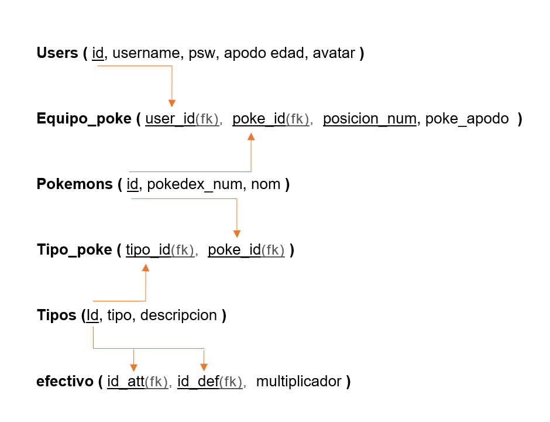

# Base de Datos - PokeTeam

---

# Enunciado

Se quiere crear una base de datos para una aplicación web llamada PokeTeam, donde los usuarios puedan registrarse, elegir un avatar y
crear su propio equipo Pokémon.

Cada usuario debe tener la siguiente información: id, username, psw, apodo, edad y avatar.

Cada usuario podrá tener un equipo Pokémon formado por varios Pokémon. En el equipo se debe guardar también la posición numérica que ocupa cada 
Pokémon dentro del equipo y si el Pokémon tiene un apodo personalizado. También se debe tener en cuenta que un Pokémon puede estar en los equipos 
de muchos usuarios.

De cada Pokémon se necesita guardar: id, pokedex_num y nom. Es importante saber que cada Pokémon puede tener uno o varios tipos. Por ejemplo,
Charmander es de tipo Fuego, pero Bulbasaur es de tipo Planta y Veneno. Además, un tipo puede pertenecer a muchos Pokémon; de cada tipo se necesita guardar: id, tipo y descripción.

Además, se quiere guardar la relación entre los tipos de los Pokémon y su efectividad en combate. Por ejemplo, el tipo Fuego es fuerte contra Planta, pero débil contra Agua. Para eso, se debe crear una tabla donde se guarde el multiplicador de daño entre un tipo atacante y un tipo defensor.

El multiplicador puede tener valores como:

- 2.0 si el ataque es muy eficaz.
- 1.0 si el daño es normal.
- 0.5 si es poco eficaz.
- 0.0 si no tiene efecto.

---

# Modelo Entidad - Relación

Aquí se muestra el modelo entidad-relación diseñado para la base de datos de PokeTeam.

  

---

# Modelo Relacional

A continuación, se muestra el modelo relacional generado a partir del modelo entidad-relación.

  

---

# Explicación de las Tablas

---

## Tabla: Users

La tabla `users` almacena la información principal de cada usuario registrado en la plataforma.

### Campos

| Campo | Descripción |
|---|---|
| id | Identificador único del usuario. |
| username | Nombre de usuario utilizado para iniciar sesión. |
| psw | Contraseña del usuario. |
| apodo | Nombre personalizado del entrenador. |
| edad | Edad del usuario. |
| avatar | Avatar seleccionado por el usuario. |

### Relación

- Un usuario puede tener varios Pokémon dentro de su equipo.
- La relación se realiza mediante la tabla `equipo_poke`.

---

## Tabla: Pokemons

La tabla `pokemons` guarda la información básica de cada Pokémon.

### Campos

| Campo | Descripción |
|---|---|
| id | Identificador único del Pokémon. |
| pokedex_num | Número oficial en la Pokédex. |
| nom | Nombre del Pokémon. |

### Relación

- Un Pokémon puede pertenecer a muchos usuarios.
- Un Pokémon puede tener uno o varios tipos.

---

## Tabla: Tipos

La tabla `tipos` almacena todos los tipos Pokémon existentes.

### Campos

| Campo | Descripción |
|---|---|
| id | Identificador único del tipo. |
| tipo | Nombre del tipo Pokémon. |
| descripcion | Explicación o descripción del tipo. |

### Relación

- Un tipo puede pertenecer a muchos Pokémon.
- Un tipo puede tener efectividad contra otros tipos.

---

## Tabla: Equipo_Poke

La tabla `equipo_poke` es una tabla intermedia que relaciona usuarios con Pokémon.

También guarda información adicional relacionada con el equipo del usuario.

### Campos

| Campo | Descripción |
|---|---|
| user_id | ID del usuario propietario del equipo. |
| poke_id | ID del Pokémon perteneciente al equipo. |
| posicion_num | Posición que ocupa el Pokémon dentro del equipo. |
| poke_apodo | Apodo personalizado del Pokémon. |

### Explicación

`posicion_num` también forma parte de la clave porque, en un equipo Pokémon, se puede tener más de un ejemplar de la misma especie.

Por ejemplo:
- Un usuario puede tener varios Pikachu.
- Cada Pikachu ocupa una posición diferente dentro del equipo.

El campo `poke_apodo` depende de toda la combinación:
- usuario
- Pokémon
- posición

Esto evita conflictos entre Pokémon repetidos dentro de un mismo equipo.

---

## Tabla: Tipo_Poke

La tabla `tipo_poke` es una tabla intermedia encargada de relacionar Pokémon con sus tipos.

### Campos

| Campo | Descripción |
|---|---|
| pokemon_id | ID del Pokémon. |
| tipo_id | ID del tipo. |

### Explicación

Esta tabla permite manejar relaciones de muchos a muchos.

Por ejemplo:
- Bulbasaur pertenece a Planta y Veneno.
- Charmander pertenece solamente a Fuego.

---

## Tabla: Efectivo

La tabla `efectivo` guarda la efectividad entre tipos Pokémon.

### Campos

| Campo | Descripción |
|---|---|
| id_att | Tipo atacante. |
| id_def | Tipo defensor. |
| multiplicador | Daño causado entre ambos tipos. |

### Multiplicadores

| Valor | Significado |
|---|---|
| 2.0 | Muy eficaz |
| 1.0 | Daño normal |
| 0.5 | Poco eficaz |
| 0.0 | No tiene efecto |

### Explicación

El sistema funciona utilizando:
- un tipo atacante (`id_att`)
- un tipo defensor (`id_def`)

Ejemplo:

| Tipo atacante | Tipo defensor | Multiplicador |
|---|---|---|
| Fuego | Planta | 2.0 |
| Fuego | Agua | 0.5 |
| Eléctrico | Tierra | 0.0 |

Las combinaciones con valor `1.0` no son obligatorias en la base de datos.

Si una combinación no existe dentro de la tabla `efectivo`, el sistema interpreta automáticamente que el daño es normal (`1.0`).

---

# Relaciones de la Base de Datos

| Relación | Tipo |
|---|---|
| Users ↔ Pokemons | Muchos a Muchos |
| Pokemons ↔ Tipos | Muchos a Muchos |
| Tipos ↔ Tipos (efectividad) | Muchos a Muchos |

---

# Objetivo del Diseño

La base de datos fue diseñada siguiendo un modelo relacional normalizado para:

- Evitar duplicación de datos.
- Mantener relaciones organizadas.
- Facilitar búsquedas complejas.
- Permitir escalabilidad.
- Mejorar el rendimiento de consultas.
- Gestionar correctamente la lógica Pokémon.

---

# Conclusión

La base de datos de PokeTeam permite gestionar usuarios, equipos Pokémon, tipos y sistemas de efectividad de manera organizada y eficiente.

Gracias al uso de relaciones muchos a muchos y tablas intermedias, el sistema puede representar correctamente la lógica real de Pokémon y facilitar futuras ampliaciones del proyecto.
